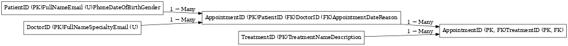

# PLP-wk8-assignment
# Clinic Booking System

##  Description
This project is a basic Clinic Booking System built using MySQL. It manages patient and doctor data, schedules appointments, and logs treatments.

## 🛠 Features
- Add and manage doctors and patients
- Book appointments
- Assign treatments to appointments
- Enforced relationships using primary and foreign keys

##  How to Run
1. Open MySQL Workbench
2. Create a new schema/database (e.g., `clinic_db`)
3. Copy and paste the code from `clinic_booking_system.sql`
4. Execute the SQL script to generate all tables

##  ERD
